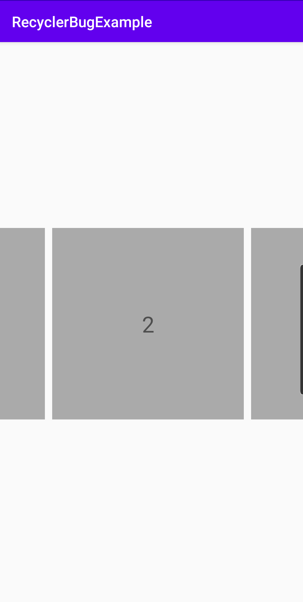
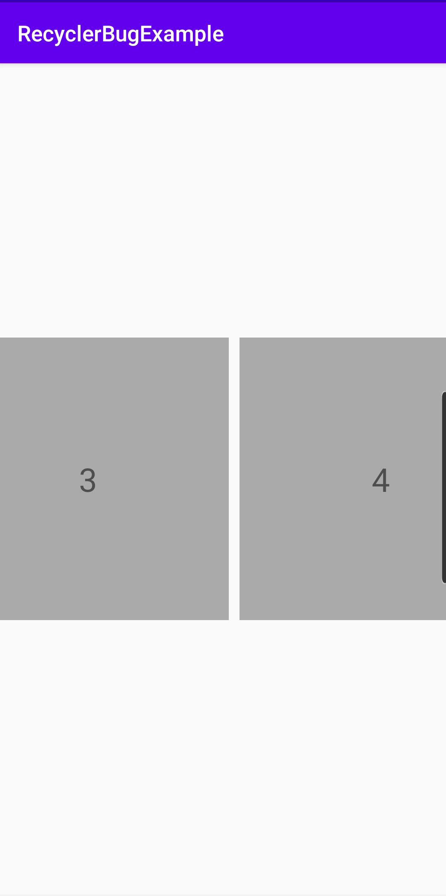

# Android RecyclerView 1.1.0 Snap Helper bug example

### Error Description

Starting from RecyclerView library 1.1.0 center snapping is not working when we have not equal padding start and padding end in horizontal recycler view.

### Steps to reproduce

By default this app uses recycler view library in version 1.0.0. With this version everything works correctly.

If you want to reproduce bug, you need to replace line: 

`implementation "androidx.recyclerview:recyclerview:1.0.0"` 

with:

`implementation "androidx.recyclerview:recyclerview:1.1.0"` or any version above 1.1.0

### Workaround solution

The only way for now to enable snapping on version 1.1.0 or above is to make padding start and padding end equal.
You can check it by replacing:

```xml
<androidx.recyclerview.widget.RecyclerView
        android:id="@+id/mainRecycler"
        android:layout_width="match_parent"
        android:layout_height="wrap_content"
        android:clipToPadding="false"
        android:paddingStart="@dimen/recycler_padding_start"
        android:paddingEnd="@dimen/recycler_padding_end"
        app:layout_constraintBottom_toBottomOf="parent"
        app:layout_constraintEnd_toEndOf="parent"
        app:layout_constraintStart_toStartOf="parent"
        app:layout_constraintTop_toTopOf="parent" />
``` 
with:
```xml
<androidx.recyclerview.widget.RecyclerView
        android:id="@+id/mainRecycler"
        android:layout_width="match_parent"
        android:layout_height="wrap_content"
        android:clipToPadding="false"
        android:paddingStart="@dimen/recycler_padding_start"
        android:paddingEnd="@dimen/recycler_padding_start"
        app:layout_constraintBottom_toBottomOf="parent"
        app:layout_constraintEnd_toEndOf="parent"
        app:layout_constraintStart_toStartOf="parent"
        app:layout_constraintTop_toTopOf="parent" />
```

inside `activity_main.xml` file

### Screenshots

Correct behaviour:



Incorrect behaviour:

